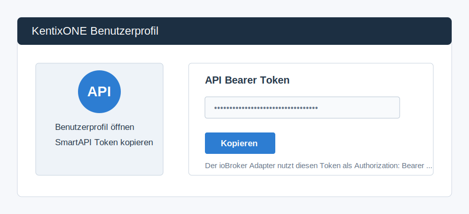
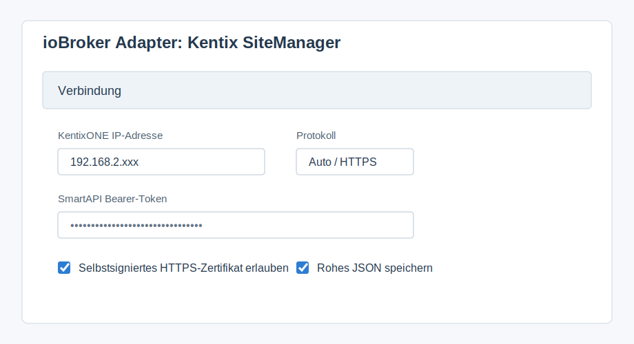
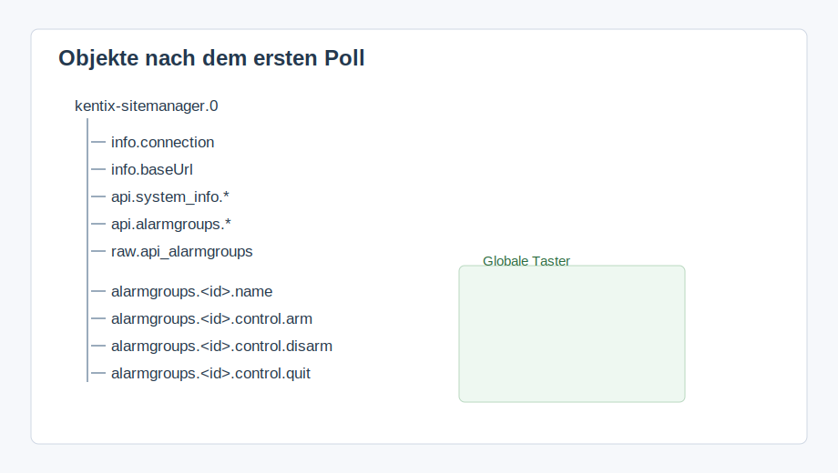

# ioBroker Kentix SiteManager Adapter

ioBroker adapter for KentixONE devices using the official Kentix SmartAPI.

The adapter reads JSON data from the Kentix SmartAPI, mirrors it dynamically into ioBroker objects and provides controls for alarm groups.



## Deutsch

### Voraussetzungen

- KentixONE SiteManager, AlarmManager, AccessManager or another KentixONE device with SmartAPI.
- Network access from ioBroker to the KentixONE IP address.
- Personal KentixONE SmartAPI Bearer token.
- A KentixONE user with permission to read data and, if required, arm/disarm/quit alarm groups.

Kentix SmartAPI requires JSON requests with `Accept: application/json` and Bearer token authentication. The adapter sends both automatically after the token is configured.

Official documentation:

- KentixONE documentation: <https://docs.kentix.com/kentixone>
- SmartAPI documentation: <https://docs.kentix.com/smartapi/latest/doc>

### Einstellungen auf der Kentix Seite

1. In KentixONE anmelden.
2. Benutzerprofil des verwendeten Benutzers öffnen.
3. SmartAPI/API Bearer token erzeugen oder kopieren.
4. Prüfen, dass dieser Benutzer die nötigen Rechte hat:
   - Lesen von Systeminformationen, Alarmgruppen und Sensor-/Moduldaten.
   - Scharf, unscharf und quittieren nur, wenn diese Steuerung über ioBroker genutzt werden soll.

### Adapter Einrichtung



1. `KentixONE IP-Adresse`: IP-Adresse des KentixONE Geräts eintragen.
2. `SmartAPI Bearer-Token`: Token aus dem KentixONE Benutzerprofil einfügen.
3. `Protokoll`: normalerweise `Auto`. Bei bekannten Installationen kann `HTTPS` oder `HTTP` fest eingetragen werden.
4. `Port`: `0` bedeutet automatisch, also 443 für HTTPS und 80 für HTTP.
5. `Selbstsigniertes HTTPS-Zertifikat erlauben`: bei lokalen KentixONE Installationen meistens aktiv lassen.
6. `Rohes JSON speichern`: speichert zusätzlich die komplette API Antwort unter `raw.*`.
7. `Feste Alarmgruppen-IDs`: optional. Kommagetrennte IDs, wenn die globalen Taster auch ohne vorher erkannte Alarmgruppe arbeiten sollen.

### Datenpunkte



- `info.connection`: Verbindung zur SmartAPI.
- `info.baseUrl`: automatisch erkannte Basis-URL.
- `info.lastError`: letzter Lese-Fehler.
- `info.lastCommandError`: letzter Steuerungs-Fehler.
- `api.*`: dynamisch gespiegelt aus den SmartAPI Antworten.
- `raw.*`: komplette JSON Antworten, wenn aktiviert.
- `alarmgroups.<id>.control.arm`: Alarmgruppe scharf schalten.
- `alarmgroups.<id>.control.disarm`: Alarmgruppe unscharf schalten.
- `alarmgroups.<id>.control.quit`: Alarmgruppe quittieren.
- `control.armAll`: alle erkannten oder fest konfigurierten Alarmgruppen scharf schalten.
- `control.disarmAll`: alle erkannten oder fest konfigurierten Alarmgruppen unscharf schalten.
- `control.quitAll`: alle erkannten oder fest konfigurierten Alarmgruppen quittieren.
- `control.refresh`: sofortige Aktualisierung starten.

### Standard SmartAPI Endpunkte

Der Adapter fragt standardmäßig diese offiziellen SmartAPI Pfade ab:

```text
/api/system/info
/api/system
/api/alarmgroups
/api/armstategroups/names
/api/log/alarm?per_page=10
/api/state/sync
/api/sitemanagers
/api/multisensors
/api/iomodules
/api/alarmmanagers
```

Unter `Eigene SmartAPI-Endpunkte` können zusätzliche oder abweichende Pfade als JSON Array, Komma-Liste oder zeilenweise eingetragen werden.

### Fehlerbehebung

- `No Kentix SmartAPI bearer token configured`: Im Adapter ist kein Token eingetragen.
- `HTTP 401`: Token falsch, abgelaufen oder Benutzer hat keine Berechtigung.
- `returned non-JSON response`: Kentix liefert eine HTML/Login-Seite statt JSON. Prüfen, ob IP, Protokoll und Token stimmen.
- `HTTP 404`: Der Endpunkt existiert auf dieser Firmware oder diesem Gerätetyp nicht.
- HTTPS Zertifikatsfehler: `Selbstsigniertes HTTPS-Zertifikat erlauben` aktivieren oder HTTP verwenden, falls am Gerät freigegeben.

## English

### Requirements

- KentixONE SiteManager, AlarmManager, AccessManager or another KentixONE device with SmartAPI.
- Network access from ioBroker to the KentixONE IP address.
- Personal KentixONE SmartAPI bearer token.
- A KentixONE user with permission to read data and, if needed, arm/disarm/quit alarm groups.

Kentix SmartAPI requires JSON requests with `Accept: application/json` and Bearer token authentication. The adapter sends both automatically after the token is configured.

Official documentation:

- KentixONE documentation: <https://docs.kentix.com/kentixone>
- SmartAPI documentation: <https://docs.kentix.com/smartapi/latest/doc>

### KentixONE setup

1. Log in to KentixONE.
2. Open the profile of the user that should be used by ioBroker.
3. Create or copy the SmartAPI/API bearer token.
4. Verify the user's permissions:
   - Read system information, alarm groups and sensor/module data.
   - Arm, disarm and quit alarm groups only if ioBroker should control alarm state.

### Adapter setup

1. `KentixONE IP address`: enter the IP address of the KentixONE device.
2. `SmartAPI bearer token`: paste the token from the KentixONE user profile.
3. `Protocol`: usually `Auto`. Use fixed `HTTPS` or `HTTP` if required.
4. `Port`: `0` means automatic, 443 for HTTPS and 80 for HTTP.
5. `Allow self-signed HTTPS certificate`: usually enabled for local KentixONE installations.
6. `Store raw JSON responses`: stores complete API responses below `raw.*`.
7. `Fixed alarmgroup IDs`: optional comma-separated IDs for global controls before discovery.

### States

- `info.connection`: SmartAPI connection status.
- `info.baseUrl`: detected base URL.
- `info.lastError`: last read error.
- `info.lastCommandError`: last command error.
- `api.*`: dynamic SmartAPI data mirror.
- `raw.*`: complete JSON responses when enabled.
- `alarmgroups.<id>.control.arm`: arm alarm group.
- `alarmgroups.<id>.control.disarm`: disarm alarm group.
- `alarmgroups.<id>.control.quit`: quit alarm group.
- `control.armAll`: arm all discovered or configured alarm groups.
- `control.disarmAll`: disarm all discovered or configured alarm groups.
- `control.quitAll`: quit all discovered or configured alarm groups.
- `control.refresh`: trigger immediate refresh.

### Default SmartAPI endpoints

The adapter polls the same default official SmartAPI paths listed in the German section. Add custom endpoints in the advanced setting if your firmware exposes additional paths.

### Troubleshooting

- `No Kentix SmartAPI bearer token configured`: no token is configured in the adapter.
- `HTTP 401`: token is wrong, expired or the user lacks permissions.
- `returned non-JSON response`: Kentix returned an HTML/login page instead of JSON. Check IP address, protocol and token.
- `HTTP 404`: endpoint is not available on this firmware or device type.
- HTTPS certificate error: enable `Allow self-signed HTTPS certificate` or use HTTP if enabled on the device.

## Changelog

### 0.2.0

- Switched to official Kentix SmartAPI authentication with Bearer token.
- Added mandatory `Accept: application/json` handling.
- Added documented alarm group controls using `/api/alarmgroups/{id}/arm`, `/disarm` and `/quit`.
- Updated bilingual documentation with setup diagrams.

### 0.1.0

- Initial test adapter.
